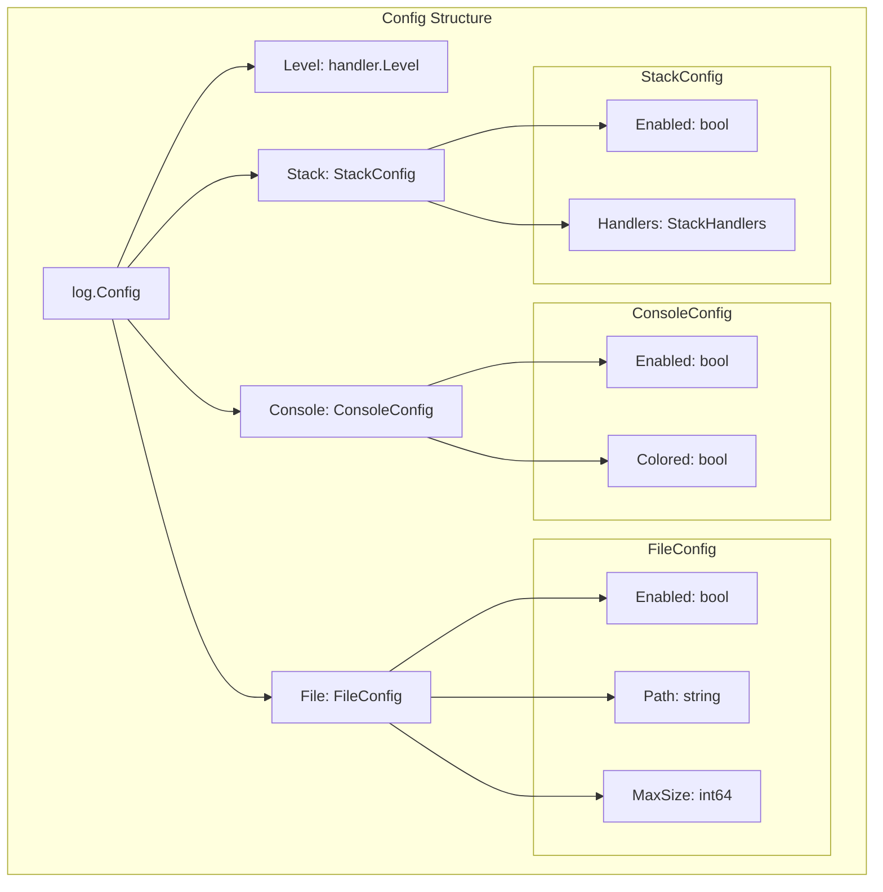
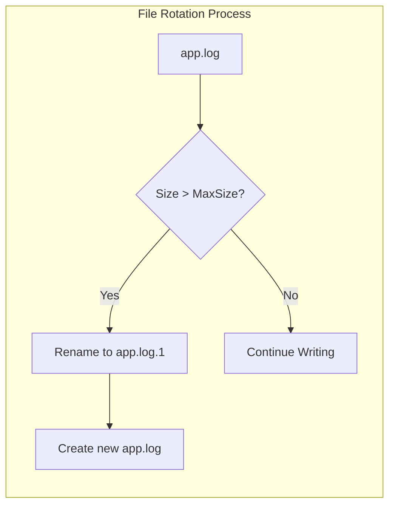
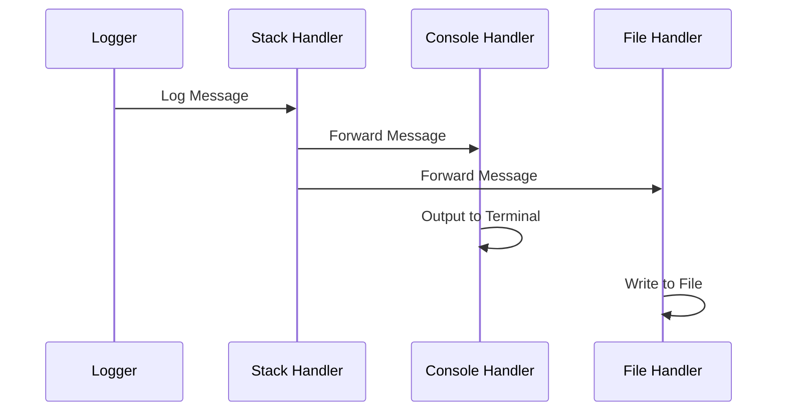

# Hướng Dẫn Cấu Hình

Tài liệu này hướng dẫn chi tiết cách cấu hình package log cho Fork Framework.

## Cấu Trúc Config



## Cấu Hình Cơ Bản

### 1. Config Struct

```go
type Config struct {
    Level   handler.Level
    Console ConsoleConfig
    File    FileConfig
    Stack   StackConfig
}
```

### 2. Log Levels

```go
// Các level được hỗ trợ
handler.DebugLevel   // Level 0 - Chi tiết nhất
handler.InfoLevel    // Level 1 - Thông tin chung
handler.WarningLevel // Level 2 - Cảnh báo
handler.ErrorLevel   // Level 3 - Lỗi
handler.FatalLevel   // Level 4 - Lỗi nghiêm trọng
```

### 3. Default Config

```go
func main() {
    // Sử dụng cấu hình mặc định
    config := log.DefaultConfig()
    
    // Default config bao gồm:
    // - Level: handler.InfoLevel
    // - Console: Enabled = true, Colored = true
    // - File: Enabled = false
    // - Stack: Enabled = false
}
```

## Console Handler Configuration

### Cấu Trúc ConsoleConfig

```go
type ConsoleConfig struct {
    Enabled bool // Bật/tắt console handler
    Colored bool // Bật/tắt màu sắc cho output
}
```

### Ví Dụ Cấu Hình Console

```go
config := &log.Config{
    Level: handler.InfoLevel,
    Console: log.ConsoleConfig{
        Enabled: true,  // Bật console logging
        Colored: true,  // Bật màu sắc
    },
}

// Console output với màu sắc:
// [DEBUG] (màu xám) Debug message
// [INFO]  (màu xanh) Info message  
// [WARN]  (màu vàng) Warning message
// [ERROR] (màu đỏ) Error message
// [FATAL] (màu đỏ đậm) Fatal message
```

### Console cho Development vs Production

```go
// Development Environment
devConfig := &log.Config{
    Level: handler.DebugLevel, // Hiển thị tất cả logs
    Console: log.ConsoleConfig{
        Enabled: true,
        Colored: true, // Dễ đọc trong terminal
    },
}

// Production Environment  
prodConfig := &log.Config{
    Level: handler.InfoLevel, // Chỉ Info và cao hơn
    Console: log.ConsoleConfig{
        Enabled: false, // Tắt console trong prod
        Colored: false,
    },
}
```

## File Handler Configuration

### Cấu Trúc FileConfig

```go
type FileConfig struct {
    Enabled bool   // Bật/tắt file handler
    Path    string // Đường dẫn file log
    MaxSize int64  // Kích thước tối đa (bytes), 0 = không giới hạn
}
```

### Ví Dụ Cấu Hình File

```go
config := &log.Config{
    Level: handler.InfoLevel,
    File: log.FileConfig{
        Enabled: true,
        Path:    "/var/log/myapp/app.log",
        MaxSize: 10 * 1024 * 1024, // 10MB
    },
}
```

### File Rotation Strategy



### Các Pattern Đường Dẫn File

```go
// Absolute path
Path: "/var/log/myapp/app.log"

// Relative path (từ thư mục chạy app)
Path: "logs/app.log"

// Date-based path
Path: fmt.Sprintf("logs/app-%s.log", time.Now().Format("2006-01-02"))

// Environment-based path
Path: filepath.Join(os.Getenv("LOG_DIR"), "app.log")
```

### File Permissions

```go
// File được tạo với permissions 0644 (rw-r--r--)
// Directory được tạo với permissions 0755 (rwxr-xr-x)

// Để thay đổi permissions, tạo file trước:
func createLogFile(path string) error {
    dir := filepath.Dir(path)
    if err := os.MkdirAll(dir, 0750); err != nil {
        return err
    }
    
    file, err := os.OpenFile(path, os.O_CREATE|os.O_WRONLY, 0640)
    if err != nil {
        return err
    }
    file.Close()
    return nil
}
```

## Stack Handler Configuration

### Cấu Trúc StackConfig

```go
type StackConfig struct {
    Enabled  bool
    Handlers StackHandlers
}

type StackHandlers struct {
    Console bool // Sử dụng console handler trong stack
    File    bool // Sử dụng file handler trong stack
}
```

### Ví Dụ Cấu Hình Stack

```go
config := &log.Config{
    Level: handler.InfoLevel,
    Console: log.ConsoleConfig{
        Enabled: true,
        Colored: true,
    },
    File: log.FileConfig{
        Enabled: true,
        Path:    "/tmp/app.log",
        MaxSize: 5 * 1024 * 1024, // 5MB
    },
    Stack: log.StackConfig{
        Enabled: true,
        Handlers: log.StackHandlers{
            Console: true, // Log đồng thời ra console
            File:    true, // và ra file
        },
    },
}
```

### Stack Handler Flow



## Cấu Hình Nâng Cao

### 1. Environment-Based Config

```go
func loadConfigFromEnv() *log.Config {
    config := log.DefaultConfig()
    
    // Override từ environment variables
    if level := os.Getenv("LOG_LEVEL"); level != "" {
        switch strings.ToLower(level) {
        case "debug":
            config.Level = handler.DebugLevel
        case "info":
            config.Level = handler.InfoLevel
        case "warning":
            config.Level = handler.WarningLevel
        case "error":
            config.Level = handler.ErrorLevel
        case "fatal":
            config.Level = handler.FatalLevel
        }
    }
    
    if logFile := os.Getenv("LOG_FILE"); logFile != "" {
        config.File.Enabled = true
        config.File.Path = logFile
    }
    
    if maxSize := os.Getenv("LOG_MAX_SIZE"); maxSize != "" {
        if size, err := strconv.ParseInt(maxSize, 10, 64); err == nil {
            config.File.MaxSize = size
        }
    }
    
    return config
}
```

### 2. YAML Configuration

```yaml
# config.yaml
log:
  level: "info"
  console:
    enabled: true
    colored: true
  file:
    enabled: true
    path: "/var/log/myapp/app.log"
    max_size: 10485760  # 10MB
  stack:
    enabled: true
    handlers:
      console: true
      file: true
```

```go
type AppConfig struct {
    Log LogConfig `yaml:"log"`
}

type LogConfig struct {
    Level   string              `yaml:"level"`
    Console ConsoleConfigYAML   `yaml:"console"`
    File    FileConfigYAML      `yaml:"file"`
    Stack   StackConfigYAML     `yaml:"stack"`
}

func loadFromYAML(filename string) (*log.Config, error) {
    data, err := ioutil.ReadFile(filename)
    if err != nil {
        return nil, err
    }
    
    var appConfig AppConfig
    if err := yaml.Unmarshal(data, &appConfig); err != nil {
        return nil, err
    }
    
    // Convert YAML config to log.Config
    return convertYAMLToLogConfig(appConfig.Log), nil
}
```

### 3. JSON Configuration

```json
{
  "log": {
    "level": "info",
    "console": {
      "enabled": true,
      "colored": true
    },
    "file": {
      "enabled": true,
      "path": "/var/log/myapp/app.log",
      "max_size": 10485760
    },
    "stack": {
      "enabled": true,
      "handlers": {
        "console": true,
        "file": true
      }
    }
  }
}
```

## Validation và Error Handling

### Config Validation

```go
func main() {
    config := &log.Config{
        Level: handler.InfoLevel,
        // ... other config
    }
    
    // Validate config trước khi sử dụng
    if err := config.Validate(); err != nil {
        log.Fatal("Invalid log config:", err)
    }
    
    manager := log.NewManager(config)
    defer manager.Close()
}
```

### Enhanced Validation Features

Package log thực hiện validation toàn diện với các tính năng mới:

```go
// 1. Directory Auto-Creation
// Validation tự động tạo thư mục log nếu chưa tồn tại
config := &log.Config{
    File: log.FileConfig{
        Path: "/var/log/myapp/app.log", // Thư mục được tạo tự động
    },
}

// 2. Write Permission Check
// Validation kiểm tra quyền ghi vào thư mục log
if err := config.Validate(); err != nil {
    // Sẽ báo lỗi nếu không có quyền ghi
    fmt.Printf("Validation failed: %v\n", err)
}

// 3. Path Always Required
// File.Path luôn được kiểm tra, bất kể File.Enabled = true/false
config := &log.Config{
    File: log.FileConfig{
        Enabled: false,           // Có thể tắt handler
        Path:    "logs/app.log",  // Nhưng path vẫn phải có
    },
}
```
```

### Common Validation Errors

```go
// Lỗi thường gặp và cách khắc phục:

// 1. Invalid log level
config.Level = handler.Level(99) // ❌ Invalid
config.Level = handler.InfoLevel  // ✅ Valid

// 2. No handlers enabled
config.Console.Enabled = false
config.File.Enabled = false
config.Stack.Enabled = false // ❌ Ít nhất một handler phải được bật

// 3. File handler without path
config.File.Enabled = true
config.File.Path = "" // ❌ Path luôn được yêu cầu cho file handler initialization

// 4. Directory permission issues
config.File.Path = "/root/logs/app.log" // ❌ Không có quyền ghi vào /root
config.File.Path = "/tmp/logs/app.log"  // ✅ Có quyền ghi

// 5. Invalid directory path
config.File.Path = "/invalid/\x00/path.log" // ❌ Path không hợp lệ
config.File.Path = "/var/log/app.log"        // ✅ Path hợp lệ

// 6. Negative max size
config.File.MaxSize = -1 // ❌ MaxSize phải >= 0

// 7. Stack handler without sub-handlers
config.Stack.Enabled = true
config.Stack.Handlers.Console = false
config.Stack.Handlers.File = false // ❌ Stack cần ít nhất một sub-handler
```

### Validation Error Messages

```go
// Các error messages mới:

// Directory creation failed
// "log config error in field 'file.path' with value '/invalid/path': log directory validation failed: permission denied"

// Write permission check failed  
// "log config error in field 'file.path' with value '/readonly/logs': log directory validation failed: permission denied"

// Path required for initialization
// "log config error in field 'file.path': path is required for file handler initialization"
```

## Best Practices

### 1. Production Configuration

```go
// Cấu hình cho production
prodConfig := &log.Config{
    Level: handler.InfoLevel, // Không log debug trong prod
    Console: log.ConsoleConfig{
        Enabled: false, // Tắt console trong prod
        Colored: false,
    },
    File: log.FileConfig{
        Enabled: true,
        Path:    "/var/log/myapp/app.log",
        MaxSize: 100 * 1024 * 1024, // 100MB cho prod
    },
    Stack: log.StackConfig{
        Enabled: false, // Không cần stack trong prod
    },
}
```

### 2. Development Configuration

```go
// Cấu hình cho development
devConfig := &log.Config{
    Level: handler.DebugLevel, // Log tất cả trong dev
    Console: log.ConsoleConfig{
        Enabled: true, // Hiển thị trên console
        Colored: true, // Dễ đọc với màu sắc
    },
    File: log.FileConfig{
        Enabled: true,
        Path:    "logs/dev.log",
        MaxSize: 10 * 1024 * 1024, // 10MB cho dev
    },
    Stack: log.StackConfig{
        Enabled: true, // Log đồng thời console và file
        Handlers: log.StackHandlers{
            Console: true,
            File:    true,
        },
    },
}
```

### 3. Performance Considerations

```go
// Để tối ưu performance:

// 1. Chỉ bật handlers cần thiết
config.Console.Enabled = false // Trong prod
config.Stack.Enabled = false   // Nếu không cần multiple outputs

// 2. Đặt level phù hợp
config.Level = handler.InfoLevel // Không log debug trong prod

// 3. Reasonable file size
config.File.MaxSize = 50 * 1024 * 1024 // 50MB, không quá lớn

// 4. Sử dụng SSD cho log files
config.File.Path = "/mnt/ssd/logs/app.log"
```

## Integration với Fork Framework

### Service Provider Configuration

```go
// providers/log_provider.go
type LogProvider struct {
    config *log.Config
}

func NewLogProvider(config *log.Config) *LogProvider {
    return &LogProvider{config: config}
}

func (p *LogProvider) Register(container *container.Container) {
    container.Singleton("log", func() interface{} {
        return log.NewManager(p.config)
    })
}

func (p *LogProvider) Boot(container *container.Container) error {
    // Configuration validation
    if err := p.config.Validate(); err != nil {
        return fmt.Errorf("log config validation failed: %w", err)
    }
    return nil
}
```

### Application Bootstrap

```go
// main.go
func main() {
    // Load config từ file hoặc environment
    logConfig := loadLogConfig()
    
    // Validate trước khi sử dụng
    if err := logConfig.Validate(); err != nil {
        log.Fatal("Invalid log configuration:", err)
    }
    
    // Tạo application với log provider
    app := fork.NewApplication()
    app.RegisterProvider(providers.NewLogProvider(logConfig))
    
    // Start application
    app.Run()
}
```

Cấu hình linh hoạt và validation chặt chẽ đảm bảo package log hoạt động ổn định trong mọi môi trường của Fork Framework.
