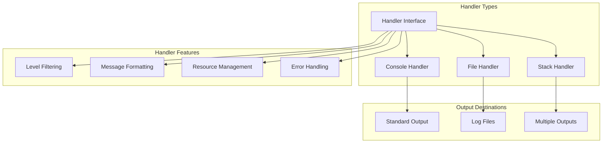
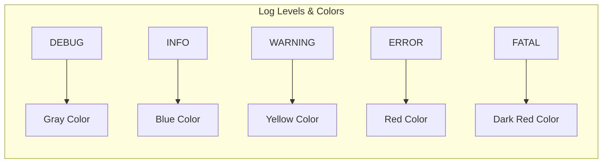
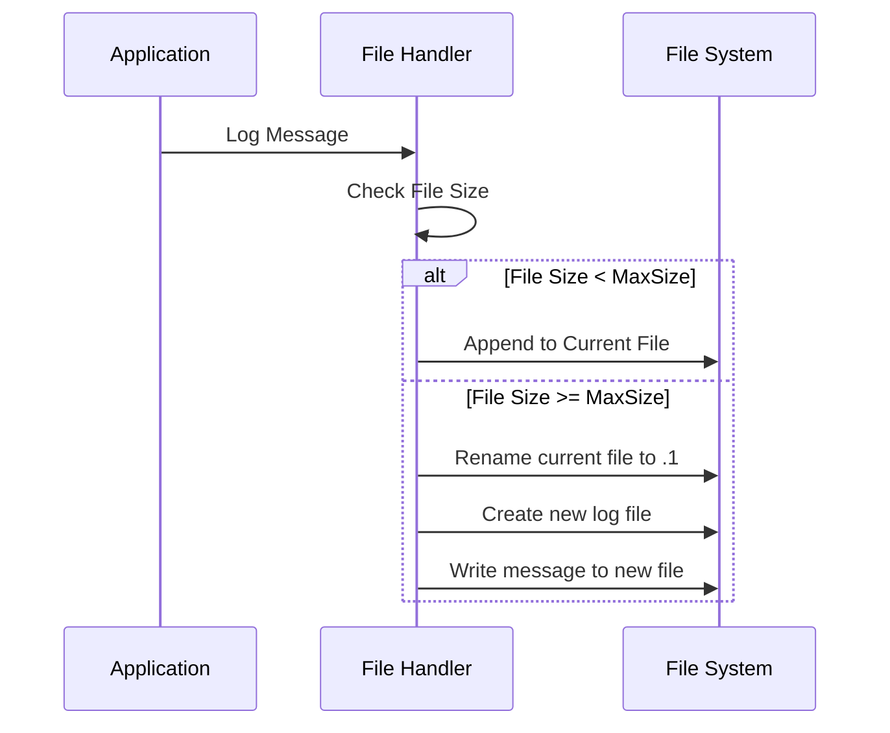
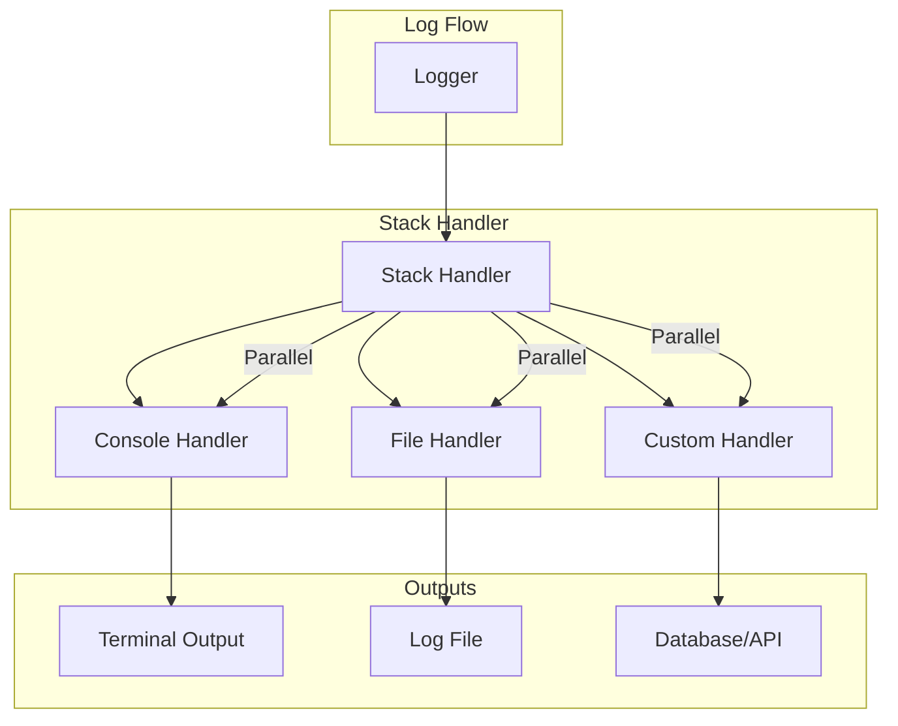
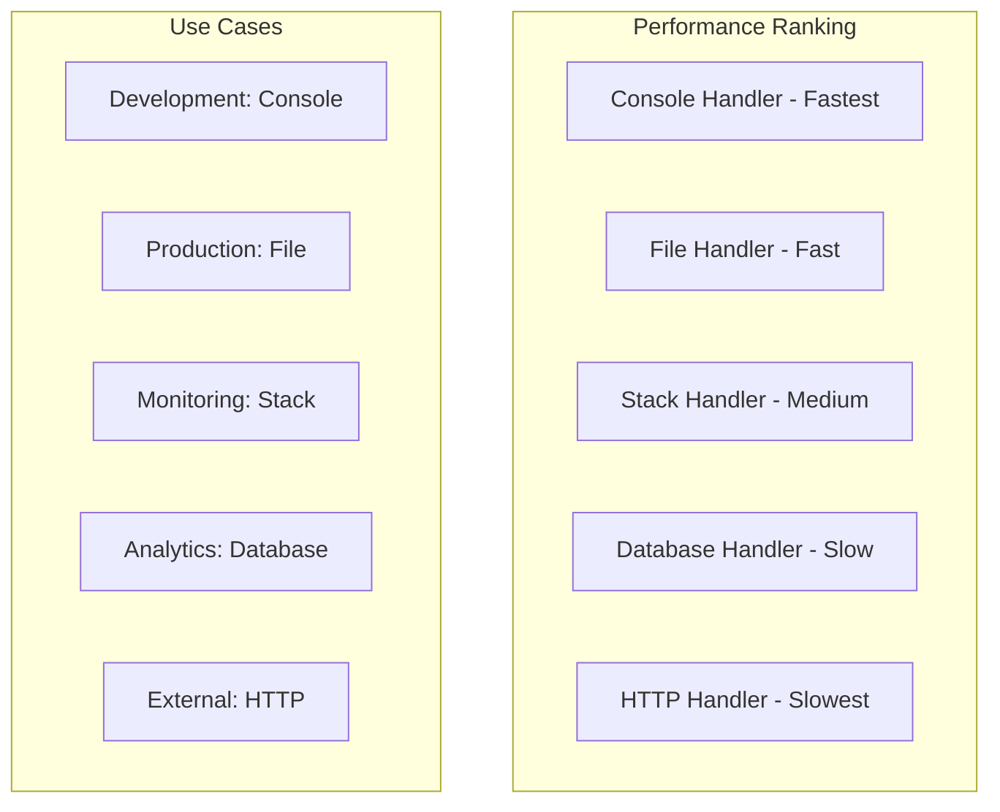

# Tài Liệu Handlers

Handlers là các thành phần xử lý và xuất logs ra các đích khác nhau. Package log cung cấp 3 loại handlers chính: Console, File, và Stack.

## Handler Interface

```go
type Handler interface {
    Log(level Level, message string, args ...interface{}) error
    Close() error
}
```

## Kiến Trúc Handlers



## Console Handler

Console Handler xuất logs ra standard output (stdout/stderr) với hỗ trợ màu sắc.

### Tính Năng

- **Colored Output**: Màu sắc khác nhau cho từng log level
- **Immediate Output**: Logs được hiển thị ngay lập tức
- **Development Friendly**: Tối ưu cho môi trường development
- **Fast Performance**: Hiệu suất cao cho debug và testing

### Khởi Tạo

```go
// Tạo console handler với màu sắc
coloredHandler := handler.NewConsoleHandler(true)

// Tạo console handler không màu sắc
plainHandler := handler.NewConsoleHandler(false)
```

### Color Scheme



### Ví Dụ Sử Dụng

```go
func main() {
    // Tạo console handler
    consoleHandler := handler.NewConsoleHandler(true)
    defer consoleHandler.Close()
    
    // Log với các levels khác nhau
    consoleHandler.Log(handler.DebugLevel, "Debug message", "key", "value")
    consoleHandler.Log(handler.InfoLevel, "Info message")
    consoleHandler.Log(handler.WarningLevel, "Warning message")
    consoleHandler.Log(handler.ErrorLevel, "Error occurred", "error", "timeout")
    consoleHandler.Log(handler.FatalLevel, "Fatal error")
}

// Output (with colors):
// [DEBUG] Debug message key=value
// [INFO]  Info message
// [WARN]  Warning message  
// [ERROR] Error occurred error=timeout
// [FATAL] Fatal error
```

### Console Handler trong Manager

```go
config := &log.Config{
    Level: handler.DebugLevel,
    Console: log.ConsoleConfig{
        Enabled: true,
        Colored: true, // Bật màu sắc
    },
}

manager := log.NewManager(config)
logger := manager.GetLogger("MyService")

// Logs sẽ xuất ra console với màu sắc
logger.Info("Service started")
logger.Error("Connection failed", "reason", "timeout")
```

## File Handler

File Handler ghi logs vào file với hỗ trợ rotation khi file đạt kích thước tối đa.

### Tính Năng

- **File Rotation**: Tự động tạo file mới khi đạt MaxSize
- **Directory Creation**: Tự động tạo thư mục nếu chưa tồn tại
- **Atomic Writes**: Đảm bảo tính toàn vẹn dữ liệu
- **Production Ready**: Tối ưu cho môi trường production

### Khởi Tạo

```go
// Tạo file handler với rotation
fileHandler, err := handler.NewFileHandler("/tmp/app.log", 10*1024*1024) // 10MB
if err != nil {
    log.Fatal("Failed to create file handler:", err)
}
defer fileHandler.Close()

// Tạo file handler không rotation (unlimited size)
unlimitedHandler, err := handler.NewFileHandler("/tmp/app.log", 0)
```

### File Rotation Process



### Ví Dụ Sử Dụng

```go
func main() {
    // Tạo file handler với rotation 5MB
    fileHandler, err := handler.NewFileHandler("logs/app.log", 5*1024*1024)
    if err != nil {
        log.Fatal("Failed to create file handler:", err)
    }
    defer fileHandler.Close()
    
    // Log messages
    for i := 0; i < 10000; i++ {
        fileHandler.Log(handler.InfoLevel, "Log message %d", i)
    }
    
    // Files sẽ được tạo:
    // logs/app.log      (file hiện tại)
    // logs/app.log.1    (file backup khi rotation)
}
```

### File Structure

```
logs/
├── app.log         # File log hiện tại
├── app.log.1       # File backup lần 1
├── app.log.2       # File backup lần 2
└── ...
```

### File Handler Configuration

```go
config := &log.Config{
    Level: handler.InfoLevel,
    File: log.FileConfig{
        Enabled: true,
        Path:    "/var/log/myapp/app.log",
        MaxSize: 50 * 1024 * 1024, // 50MB
    },
}

manager := log.NewManager(config)
logger := manager.GetLogger("FileService")

// Logs sẽ được ghi vào file
logger.Info("File operation started")
logger.Error("File not found", "path", "/tmp/missing.txt")
```

### Error Handling

```go
// File handler xử lý các lỗi sau:
// 1. Permission denied
// 2. Disk full
// 3. Path not exists
// 4. File locked

fileHandler, err := handler.NewFileHandler("/invalid/path/app.log", 1024)
if err != nil {
    // Handle creation error
    log.Printf("Failed to create file handler: %v", err)
    return
}

// Log errors được xử lý internally
err = fileHandler.Log(handler.InfoLevel, "Test message")
if err != nil {
    // Handle logging error
    log.Printf("Failed to write log: %v", err)
}
```

## Stack Handler

Stack Handler kết hợp nhiều handlers khác, cho phép ghi logs đồng thời ra nhiều đích.

### Tính Năng

- **Multiple Outputs**: Ghi logs ra nhiều đích cùng lúc
- **Handler Composition**: Kết hợp các handlers khác nhau
- **Error Resilience**: Tiếp tục hoạt động nếu một handler lỗi
- **Flexible Configuration**: Cấu hình linh hoạt sub-handlers

### Khởi Tạo

```go
// Tạo stack handler
stackHandler := handler.NewStackHandler()

// Thêm các sub-handlers
consoleHandler := handler.NewConsoleHandler(true)
fileHandler, _ := handler.NewFileHandler("logs/app.log", 10*1024*1024)

stackHandler.AddHandler(consoleHandler)
stackHandler.AddHandler(fileHandler)

defer stackHandler.Close() // Sẽ close tất cả sub-handlers
```

### Stack Handler Architecture



### Ví Dụ Sử Dụng

```go
func main() {
    // Tạo stack handler
    stackHandler := handler.NewStackHandler()
    
    // Thêm console handler
    consoleHandler := handler.NewConsoleHandler(true)
    stackHandler.AddHandler(consoleHandler)
    
    // Thêm file handler
    fileHandler, err := handler.NewFileHandler("logs/stack.log", 5*1024*1024)
    if err == nil {
        stackHandler.AddHandler(fileHandler)
    }
    
    defer stackHandler.Close()
    
    // Log sẽ xuất ra cả console và file
    stackHandler.Log(handler.InfoLevel, "Message to both outputs")
    stackHandler.Log(handler.ErrorLevel, "Error logged everywhere", "code", 500)
}

// Output:
// Console: [INFO] Message to both outputs
// File:    [INFO] Message to both outputs
// Console: [ERROR] Error logged everywhere code=500  
// File:    [ERROR] Error logged everywhere code=500
```

### Stack Handler trong Manager

```go
config := &log.Config{
    Level: handler.InfoLevel,
    Console: log.ConsoleConfig{
        Enabled: true,
        Colored: true,
    },
    File: log.FileConfig{
        Enabled: true,
        Path:    "logs/app.log",
        MaxSize: 10 * 1024 * 1024,
    },
    Stack: log.StackConfig{
        Enabled: true,
        Handlers: log.StackHandlers{
            Console: true, // Bao gồm console handler
            File:    true, // Bao gồm file handler
        },
    },
}

manager := log.NewManager(config)
logger := manager.GetLogger("StackService")

// Log ra cả console và file thông qua stack handler
logger.Info("Service initialized")
logger.Warning("Low memory", "available", "500MB")
```

### Error Handling trong Stack

```go
// Stack handler xử lý lỗi từ sub-handlers một cách graceful
stackHandler := handler.NewStackHandler()

// Thêm handler có thể lỗi
problematicHandler := &ProblematicHandler{}
stackHandler.AddHandler(problematicHandler)

// Thêm handler hoạt động bình thường
consoleHandler := handler.NewConsoleHandler(true)
stackHandler.AddHandler(consoleHandler)

// Nếu problematicHandler lỗi, consoleHandler vẫn hoạt động
err := stackHandler.Log(handler.InfoLevel, "Test message")
// err sẽ chứa lỗi từ problematicHandler nhưng message vẫn được log ra console
```

## Custom Handlers

Bạn có thể tạo custom handlers bằng cách implement Handler interface:

### Database Handler Example

```go
type DatabaseHandler struct {
    db *sql.DB
}

func NewDatabaseHandler(db *sql.DB) *DatabaseHandler {
    return &DatabaseHandler{db: db}
}

func (h *DatabaseHandler) Log(level handler.Level, message string, args ...interface{}) error {
    // Chuẩn bị log entry
    entry := map[string]interface{}{
        "level":     level.String(),
        "message":   message,
        "timestamp": time.Now(),
    }
    
    // Thêm args vào entry
    for i := 0; i < len(args); i += 2 {
        if i+1 < len(args) {
            key := fmt.Sprintf("%v", args[i])
            value := args[i+1]
            entry[key] = value
        }
    }
    
    // Insert vào database
    query := `INSERT INTO logs (level, message, data, created_at) VALUES (?, ?, ?, ?)`
    data, _ := json.Marshal(entry)
    _, err := h.db.Exec(query, level.String(), message, string(data), time.Now())
    
    return err
}

func (h *DatabaseHandler) Close() error {
    // Database connection được quản lý bởi application
    return nil
}
```

### HTTP Handler Example

```go
type HTTPHandler struct {
    endpoint string
    client   *http.Client
}

func NewHTTPHandler(endpoint string) *HTTPHandler {
    return &HTTPHandler{
        endpoint: endpoint,
        client:   &http.Client{Timeout: 5 * time.Second},
    }
}

func (h *HTTPHandler) Log(level handler.Level, message string, args ...interface{}) error {
    // Tạo payload
    payload := map[string]interface{}{
        "level":     level.String(),
        "message":   message,
        "timestamp": time.Now().Unix(),
        "data":      h.argsToMap(args),
    }
    
    // Serialize payload
    data, err := json.Marshal(payload)
    if err != nil {
        return err
    }
    
    // Send HTTP request
    resp, err := h.client.Post(h.endpoint, "application/json", bytes.NewBuffer(data))
    if err != nil {
        return err
    }
    defer resp.Body.Close()
    
    if resp.StatusCode >= 400 {
        return fmt.Errorf("HTTP handler failed: %d", resp.StatusCode)
    }
    
    return nil
}

func (h *HTTPHandler) Close() error {
    h.client.CloseIdleConnections()
    return nil
}

func (h *HTTPHandler) argsToMap(args []interface{}) map[string]interface{} {
    result := make(map[string]interface{})
    for i := 0; i < len(args); i += 2 {
        if i+1 < len(args) {
            key := fmt.Sprintf("%v", args[i])
            result[key] = args[i+1]
        }
    }
    return result
}
```

### Sử Dụng Custom Handlers

```go
func main() {
    config := log.DefaultConfig()
    manager := log.NewManager(config)
    
    // Thêm custom database handler
    db, _ := sql.Open("mysql", "user:pass@tcp(localhost:3306)/logs")
    dbHandler := NewDatabaseHandler(db)
    manager.AddHandler("database", dbHandler)
    
    // Thêm custom HTTP handler
    httpHandler := NewHTTPHandler("https://api.example.com/logs")
    manager.AddHandler("http", httpHandler)
    
    // Set custom handler cho logger cụ thể
    logger := manager.GetLogger("CustomService")
    manager.SetHandler("CustomService", "database")
    
    // Log sẽ được ghi vào database
    logger.Info("Custom handler working", "user_id", 12345)
    
    defer manager.Close()
}
```

## Performance Considerations

### Handler Performance Comparison



### Best Practices

1. **Console Handler**: Chỉ sử dụng trong development
2. **File Handler**: Primary choice cho production
3. **Stack Handler**: Khi cần multiple outputs
4. **Custom Handlers**: Cho integration với external systems

### Optimization Tips

```go
// 1. Sử dụng appropriate buffer sizes
fileHandler := handler.NewFileHandler("app.log", 50*1024*1024) // 50MB rotation

// 2. Tránh quá nhiều handlers trong stack
stackHandler := handler.NewStackHandler()
// Chỉ thêm handlers thực sự cần thiết
stackHandler.AddHandler(consoleHandler)
stackHandler.AddHandler(fileHandler)
// Tránh: stackHandler.AddHandler(tooManyHandlers...)

// 3. Handle errors gracefully
if err := handler.Log(level, message); err != nil {
    // Fallback mechanism
    fallbackHandler.Log(level, "Original log failed: "+message)
}

// 4. Close handlers properly
defer func() {
    if err := handler.Close(); err != nil {
        log.Printf("Failed to close handler: %v", err)
    }
}()
```

Handlers là nền tảng của package log, cung cấp flexibility và performance cho mọi use case trong Fork Framework.
