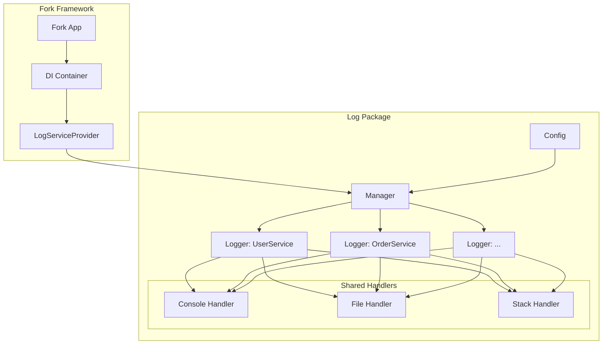

# Tài Liệu Package Log

Package log cung cấp khả năng logging có cấu trúc cho các ứng dụng Fork Framework, tích hợp mượt mà với dependency injection container và service provider pattern.

## Điều Hướng Nhanh

- **[Tổng Quan](overview.md)** - Kiến trúc và khái niệm logging
- **[Cấu Hình](configuration.md)** - Hướng dẫn cấu hình chi tiết  
- **[Handlers](handler.md)** - Tài liệu về các handler types
- **[Logger](logger.md)** - Interface và sử dụng logger
- **[Workflows](workflows.md)** - Quy trình làm việc và patterns

## Khởi Động Nhanh

```go
package main

import (
    "go.fork.vn/log"
    "go.fork.vn/log/handler"
)

func main() {
    // Tạo cấu hình logging
    config := &log.Config{
        Level: handler.InfoLevel,
        Console: log.ConsoleConfig{
            Enabled: true,
            Colored: true,
        },
        File: log.FileConfig{
            Enabled: true,
            Path:    "/tmp/app.log",
            MaxSize: 10 * 1024 * 1024, // 10MB
        },
        Stack: log.StackConfig{
            Enabled: true,
            Handlers: log.StackHandlers{
                Console: true,
                File:    true,
            },
        },
    }
    
    // Tạo manager
    manager := log.NewManager(config)
    defer manager.Close()
    
    // Lấy logger theo context
    userLogger := manager.GetLogger("UserService")
    orderLogger := manager.GetLogger("OrderService")
    
    // Logging cơ bản
    userLogger.Info("Người dùng đã đăng nhập", "user_id", 12345)
    orderLogger.Warning("Tồn kho thấp", "product_id", "ABC123", "stock", 2)
    userLogger.Error("Lỗi kết nối database", "error", "connection timeout")
}
```

## Tính Năng Chính

- **Shared Handlers**: Các handler được chia sẻ giữa nhiều logger instances
- **Contextual Loggers**: Logger được tạo theo context để dễ dàng phân biệt nguồn gốc
- **Multi-Level Support**: Hỗ trợ Debug, Info, Warning, Error, và Fatal log levels
- **Flexible Configuration**: Cấu hình linh hoạt cho console, file, và stack handlers
- **Runtime Management**: Quản lý handlers và loggers trong runtime
- **Performance**: Tối ưu hóa cho các ứng dụng hiệu suất cao
- **Fork Framework Integration**: Tích hợp sâu với dependency injection và service providers

## Cài Đặt

```bash
go get go.fork.vn/log@latest
```

## Sử Dụng trong Fork Framework

### 1. Service Provider Registration

```go
// main.go
func main() {
    app := fork.NewApplication()
    
    // Đăng ký log service provider
    logConfig := log.DefaultConfig()
    app.RegisterProvider(providers.NewLogProvider(logConfig))
    
    // Đăng ký các providers khác
    app.RegisterProvider(providers.NewUserServiceProvider())
    
    app.Run()
}
```

### 2. Service Injection

```go
// services/user_service.go
type UserService struct {
    logger log.Logger
    db     *database.DB
}

func NewUserService(container *container.Container) *UserService {
    manager := container.Get("log").(log.Manager)
    
    return &UserService{
        logger: manager.GetLogger("UserService"),
        db:     container.Get("database").(*database.DB),
    }
}

func (s *UserService) CreateUser(user *User) error {
    s.logger.Info("Creating user", "username", user.Username)
    
    if err := s.db.Create(user); err != nil {
        s.logger.Error("Failed to create user", 
            "username", user.Username, 
            "error", err.Error(),
        )
        return err
    }
    
    s.logger.Info("User created successfully", 
        "user_id", user.ID,
        "username", user.Username,
    )
    
    return nil
}
```

## Cấu Trúc Package

```
log/
├── docs/
│   ├── index.md         # File này - Trang chủ tài liệu
│   ├── overview.md      # Kiến trúc và khái niệm
│   ├── configuration.md # Hướng dẫn cấu hình
│   ├── handler.md       # Tài liệu handlers
│   ├── logger.md        # Interface Logger
│   └── workflows.md     # Quy trình và patterns
├── handler/             # Các handler implementations
│   ├── console.go       # Console handler
│   ├── file.go          # File handler
│   ├── stack.go         # Stack handler
│   └── handler.go       # Handler interface
├── mocks/               # Generated mocks
├── examples/            # Ví dụ sử dụng
├── config.go            # Configuration structures
├── constants.go         # Handler type constants
├── logger.go            # Logger interface và implementation
├── manager.go           # Manager interface và implementation
├── provider.go          # Service provider cho Fork Framework
└── doc.go              # Package documentation
```

## Levels Logging

Package hỗ trợ các levels logging chuẩn:

- **Debug**: Thông tin chi tiết để chẩn đoán vấn đề
- **Info**: Thông tin chung về luồng ứng dụng
- **Warning**: Cảnh báo về các tình huống có thể gây hại
- **Error**: Sự kiện lỗi có thể vẫn cho phép ứng dụng tiếp tục
- **Fatal**: Lỗi nghiêm trọng có thể dẫn đến ứng dụng dừng lại

## Kiến Trúc Tổng Quan



## Ví Dụ Nâng Cao

### Middleware Logging

```go
func LoggingMiddleware(manager log.Manager) func(http.Handler) http.Handler {
    logger := manager.GetLogger("HTTPMiddleware")
    
    return func(next http.Handler) http.Handler {
        return http.HandlerFunc(func(w http.ResponseWriter, r *http.Request) {
            start := time.Now()
            
            logger.Info("HTTP request started",
                "method", r.Method,
                "path", r.URL.Path,
                "remote_addr", r.RemoteAddr,
            )
            
            next.ServeHTTP(w, r)
            
            logger.Info("HTTP request completed",
                "method", r.Method,
                "path", r.URL.Path,
                "duration", time.Since(start).String(),
            )
        })
    }
}
```

### Custom Handler

```go
type DatabaseHandler struct {
    db *sql.DB
}

func (h *DatabaseHandler) Log(level handler.Level, message string, args ...interface{}) error {
    query := `INSERT INTO logs (level, message, data, created_at) VALUES (?, ?, ?, ?)`
    data, _ := json.Marshal(h.argsToMap(args))
    _, err := h.db.Exec(query, level.String(), message, string(data), time.Now())
    return err
}
```

## Lấy Trợ Giúp

- Đọc [Tổng Quan](overview.md) để hiểu kiến trúc và khái niệm
- Xem [Cấu Hình](configuration.md) để biết cách cấu hình package
- Tham khảo [Handlers](handler.md) để hiểu các loại handler
- Nghiên cứu [Logger](logger.md) để sử dụng logger interface
- Theo dõi [Workflows](workflows.md) để áp dụng patterns hiệu quả
- Tham khảo các examples trong thư mục `examples/`

---

**Ghi chú**: Tài liệu này được viết cho Fork Framework. Package log được thiết kế để tích hợp sâu với các thành phần khác của framework như dependency injection container và service provider pattern.
