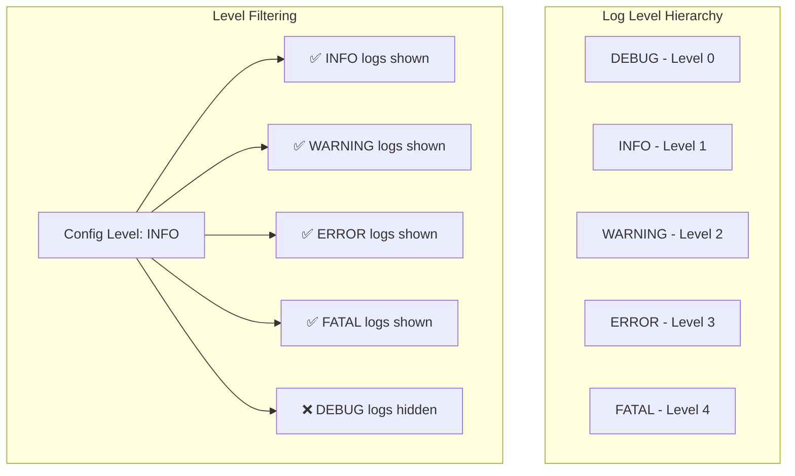

# Tài Liệu Logger Interface

Logger là interface chính để thực hiện logging trong Fork Framework. Mỗi logger được gắn với một context cụ thể và có thể sử dụng nhiều handlers khác nhau.

## Logger Interface

```go
type Logger interface {
    // Các method logging theo level
    Debug(message string, args ...interface{})
    Info(message string, args ...interface{})
    Warning(message string, args ...interface{})
    Error(message string, args ...interface{})
    Fatal(message string, args ...interface{})
    
    // Quản lý context và handlers
    SetContext(context string)
    GetContext() string
    AddHandler(handler handler.Handler)
    RemoveHandler(handler handler.Handler)
    Close() error
}
```

## Kiến Trúc Logger

```mermaid
graph TB
    subgraph "Logger Architecture"
        Logger[Logger Instance]
        Context[Context: "ServiceName"]
        Level[Min Level Filter]
        Handlers[Handler Collection]
        
        Logger --> Context
        Logger --> Level  
        Logger --> Handlers
        
        subgraph "Handlers"
            H1[Console Handler]
            H2[File Handler]
            H3[Stack Handler]
            HN[Custom Handlers...]
        end
        
        Handlers --> H1
        Handlers --> H2
        Handlers --> H3
        Handlers --> HN
    end
    
    subgraph "Log Flow"
        Input[Log Method Call] --> Filter{Level >= Min?}
        Filter -->|Yes| Format[Format Message]
        Filter -->|No| Skip[Skip Log]
        Format --> Distribute[Distribute to Handlers]
        Distribute --> Output[Multiple Outputs]
    end
```

## Contextual Logging

### Context trong Logger

Context giúp xác định nguồn gốc của log messages:

```go
// Logger với context cụ thể
userLogger := manager.GetLogger("UserService")
orderLogger := manager.GetLogger("OrderService") 
paymentLogger := manager.GetLogger("PaymentService")

// Mỗi log sẽ có context prefix
userLogger.Info("User logged in", "user_id", 12345)
// Output: [INFO] [UserService] User logged in user_id=12345

orderLogger.Warning("Low stock", "product_id", "ABC123")
// Output: [WARN] [OrderService] Low stock product_id=ABC123

paymentLogger.Error("Payment failed", "reason", "insufficient_funds")
// Output: [ERROR] [PaymentService] Payment failed reason=insufficient_funds
```

### Context Hierarchy

```go
// Có thể tạo context phân cấp
baseLogger := manager.GetLogger("UserService")
authLogger := manager.GetLogger("UserService::Authentication")
profileLogger := manager.GetLogger("UserService::Profile")

authLogger.Info("Login attempt", "username", "john_doe")
// Output: [INFO] [UserService::Authentication] Login attempt username=john_doe

profileLogger.Info("Profile updated", "user_id", 12345)
// Output: [INFO] [UserService::Profile] Profile updated user_id=12345
```

### Dynamic Context

```go
func processOrder(orderID string) {
    logger := manager.GetLogger("OrderService")
    
    // Cập nhật context để include order ID
    logger.SetContext(fmt.Sprintf("OrderService::Order_%s", orderID))
    
    logger.Info("Processing order")
    // Output: [INFO] [OrderService::Order_12345] Processing order
    
    // ... process logic ...
    
    logger.Info("Order completed")
    // Output: [INFO] [OrderService::Order_12345] Order completed
}
```

## Log Levels

### Level Hierarchy



### Sử Dụng Levels

```go
logger := manager.GetLogger("MyService")

// Debug: Chi tiết implementation, chỉ trong development
logger.Debug("Database query executed", "query", "SELECT * FROM users", "duration", "2ms")

// Info: Thông tin chung về hoạt động của service
logger.Info("Service started successfully", "port", 8080, "version", "1.2.3")

// Warning: Các tình huống bất thường nhưng không critical
logger.Warning("High memory usage detected", "usage", "85%", "threshold", "80%")

// Error: Lỗi xảy ra nhưng service vẫn có thể tiếp tục
logger.Error("Failed to send email", "recipient", "user@example.com", "error", "timeout")

// Fatal: Lỗi nghiêm trọng có thể dẫn đến service dừng
logger.Fatal("Database connection lost", "host", "db.example.com", "error", "connection refused")
```

## Structured Logging

### Key-Value Arguments

```go
logger := manager.GetLogger("APIService")

// Structured logging với key-value pairs
logger.Info("HTTP request received",
    "method", "POST",
    "path", "/api/users",
    "user_id", 12345,
    "ip", "192.168.1.100",
    "user_agent", "MyApp/1.0",
)

// Output: [INFO] [APIService] HTTP request received method=POST path=/api/users user_id=12345 ip=192.168.1.100 user_agent=MyApp/1.0
```

### Complex Data Types

```go
type User struct {
    ID       int    `json:"id"`
    Username string `json:"username"`
    Email    string `json:"email"`
}

user := User{ID: 12345, Username: "john_doe", Email: "john@example.com"}

// Log complex objects
logger.Info("User created",
    "user", user,
    "metadata", map[string]interface{}{
        "source": "registration_form",
        "ip":     "192.168.1.100",
    },
    "timestamp", time.Now(),
)
```

### Error Logging

```go
func processPayment(amount float64) error {
    logger := manager.GetLogger("PaymentService")
    
    err := chargeCard(amount)
    if err != nil {
        // Log error với context chi tiết
        logger.Error("Payment processing failed",
            "amount", amount,
            "error", err.Error(),
            "error_type", fmt.Sprintf("%T", err),
            "stack_trace", fmt.Sprintf("%+v", err),
        )
        return err
    }
    
    logger.Info("Payment processed successfully",
        "amount", amount,
        "transaction_id", generateTransactionID(),
    )
    
    return nil
}
```

## Logger trong Fork Framework Services

### Service Constructor Injection

```go
type UserService struct {
    logger log.Logger
    db     *database.DB
}

func NewUserService(container *container.Container) *UserService {
    // Inject logger từ container
    manager := container.Get("log").(log.Manager)
    
    return &UserService{
        logger: manager.GetLogger("UserService"),
        db:     container.Get("database").(*database.DB),
    }
}

func (s *UserService) CreateUser(user *User) error {
    s.logger.Info("Creating new user", "username", user.Username)
    
    err := s.db.Create(user)
    if err != nil {
        s.logger.Error("Failed to create user",
            "username", user.Username,
            "error", err.Error(),
        )
        return err
    }
    
    s.logger.Info("User created successfully",
        "user_id", user.ID,
        "username", user.Username,
    )
    
    return nil
}
```

### Controller Logging

```go
type UserController struct {
    service *UserService
    logger  log.Logger
}

func NewUserController(container *container.Container) *UserController {
    manager := container.Get("log").(log.Manager)
    
    return &UserController{
        service: container.Get("user_service").(*UserService),
        logger:  manager.GetLogger("UserController"),
    }
}

func (c *UserController) HandleCreateUser(w http.ResponseWriter, r *http.Request) {
    c.logger.Info("Create user request received",
        "method", r.Method,
        "path", r.URL.Path,
        "remote_addr", r.RemoteAddr,
    )
    
    var user User
    if err := json.NewDecoder(r.Body).Decode(&user); err != nil {
        c.logger.Warning("Invalid request body",
            "error", err.Error(),
            "content_type", r.Header.Get("Content-Type"),
        )
        http.Error(w, "Invalid JSON", http.StatusBadRequest)
        return
    }
    
    if err := c.service.CreateUser(&user); err != nil {
        c.logger.Error("User creation failed",
            "username", user.Username,
            "error", err.Error(),
        )
        http.Error(w, "Internal Server Error", http.StatusInternalServerError)
        return
    }
    
    c.logger.Info("User created via API",
        "user_id", user.ID,
        "username", user.Username,
    )
    
    w.Header().Set("Content-Type", "application/json")
    json.NewEncoder(w).Encode(user)
}
```

### Middleware Logging

```go
func LoggingMiddleware(manager log.Manager) func(http.Handler) http.Handler {
    logger := manager.GetLogger("HTTPMiddleware")
    
    return func(next http.Handler) http.Handler {
        return http.HandlerFunc(func(w http.ResponseWriter, r *http.Request) {
            start := time.Now()
            
            // Log request
            logger.Info("HTTP request started",
                "method", r.Method,
                "path", r.URL.Path,
                "user_agent", r.UserAgent(),
                "remote_addr", r.RemoteAddr,
            )
            
            // Wrap response writer to capture status code
            wrapper := &ResponseWrapper{ResponseWriter: w, statusCode: 200}
            
            // Process request
            next.ServeHTTP(wrapper, r)
            
            duration := time.Since(start)
            
            // Log response
            logger.Info("HTTP request completed",
                "method", r.Method,
                "path", r.URL.Path,
                "status_code", wrapper.statusCode,
                "duration", duration.String(),
                "duration_ms", duration.Milliseconds(),
            )
        })
    }
}

type ResponseWrapper struct {
    http.ResponseWriter
    statusCode int
}

func (w *ResponseWrapper) WriteHeader(statusCode int) {
    w.statusCode = statusCode
    w.ResponseWriter.WriteHeader(statusCode)
}
```

## Advanced Logger Features

### Logger với Custom Handlers

```go
// Tạo logger với custom handler
logger := manager.GetLogger("CustomService")

// Thêm database handler cho audit logging
dbHandler := NewDatabaseHandler(db)
logger.AddHandler(dbHandler)

// Thêm HTTP handler cho external monitoring
httpHandler := NewHTTPHandler("https://monitoring.example.com/logs")
logger.AddHandler(httpHandler)

// Log sẽ được ghi ra console, file, database, và HTTP endpoint
logger.Info("Critical business event",
    "event_type", "payment_processed",
    "amount", 1000.00,
    "user_id", 12345,
)
```

### Conditional Logging

```go
func conditionalLogging(logger log.Logger, debug bool) {
    // Chỉ log debug khi flag được bật
    if debug {
        logger.Debug("Debug information", "state", getCurrentState())
    }
    
    // Luôn log thông tin quan trọng
    logger.Info("Operation completed", "success", true)
}

// Performance optimization: check level trước khi format
func expensiveLogging(logger log.Logger) {
    // Tránh expensive operation nếu debug không được log
    if isDebugEnabled(logger) {
        expensiveData := generateExpensiveDebugData()
        logger.Debug("Expensive debug data", "data", expensiveData)
    }
}
```

### Logger Decorator Pattern

```go
type TimedLogger struct {
    logger log.Logger
}

func NewTimedLogger(logger log.Logger) *TimedLogger {
    return &TimedLogger{logger: logger}
}

func (tl *TimedLogger) LogWithDuration(level string, message string, fn func(), args ...interface{}) {
    start := time.Now()
    
    // Add start log
    allArgs := append(args, "operation_start", start)
    tl.logger.Info(message+" started", allArgs...)
    
    // Execute function
    fn()
    
    duration := time.Since(start)
    
    // Add completion log
    allArgs = append(args, "duration", duration.String(), "duration_ms", duration.Milliseconds())
    tl.logger.Info(message+" completed", allArgs...)
}

// Usage
func processData(logger log.Logger) {
    timedLogger := NewTimedLogger(logger)
    
    timedLogger.LogWithDuration("info", "Data processing", func() {
        // Expensive data processing...
        time.Sleep(2 * time.Second)
    }, "dataset_size", 10000)
}
```

## Performance Best Practices

### 1. Level-based Filtering

```go
// ❌ Không tối ưu: luôn tạo expensive string
logger.Debug(fmt.Sprintf("Processing %d items: %v", len(items), items))

// ✅ Tối ưu: chỉ format khi cần thiết
logger.Debug("Processing items", "count", len(items), "items", items)
```

### 2. Lazy Evaluation

```go
// ❌ Không tối ưu: expensive operation luôn chạy
expensiveData := generateExpensiveData()
logger.Debug("Debug data", "data", expensiveData)

// ✅ Tối ưu: conditional execution
if shouldLogDebug() {
    expensiveData := generateExpensiveData()
    logger.Debug("Debug data", "data", expensiveData)
}
```

### 3. Handler Selection

```go
// Development: prioritize console output
devLogger := manager.GetLogger("DevService")
// Console handler tự động được thêm từ config

// Production: prioritize file output  
prodLogger := manager.GetLogger("ProdService")
// File handler tự động được thêm từ config
// Console handler bị tắt trong production config
```

### 4. Context Optimization

```go
// ❌ Tạo logger mới mỗi lần
func processRequest(requestID string) {
    logger := manager.GetLogger(fmt.Sprintf("RequestProcessor_%s", requestID))
    // ...
}

// ✅ Reuse logger với dynamic context
var requestLogger = manager.GetLogger("RequestProcessor")

func processRequest(requestID string) {
    // Clone logger hoặc sử dụng context argument
    logger.Info("Processing request", "request_id", requestID)
    // ...
}
```

## Testing với Loggers

### Mock Logger

```go
type MockLogger struct {
    logs []LogEntry
}

type LogEntry struct {
    Level   string
    Message string
    Args    []interface{}
}

func (m *MockLogger) Info(message string, args ...interface{}) {
    m.logs = append(m.logs, LogEntry{
        Level:   "INFO",
        Message: message,
        Args:    args,
    })
}

// Implement other methods...

func (m *MockLogger) GetLogs() []LogEntry {
    return m.logs
}

func (m *MockLogger) HasLog(level, message string) bool {
    for _, log := range m.logs {
        if log.Level == level && log.Message == message {
            return true
        }
    }
    return false
}
```

### Test Example

```go
func TestUserService_CreateUser(t *testing.T) {
    // Setup
    mockLogger := &MockLogger{}
    service := &UserService{logger: mockLogger}
    
    // Execute
    user := &User{Username: "testuser"}
    err := service.CreateUser(user)
    
    // Assert
    assert.NoError(t, err)
    assert.True(t, mockLogger.HasLog("INFO", "Creating new user"))
    assert.True(t, mockLogger.HasLog("INFO", "User created successfully"))
}
```

Logger interface cung cấp foundation mạnh mẽ và linh hoạt cho logging trong Fork Framework, hỗ trợ từ simple console logging đến complex structured logging với multiple outputs.
