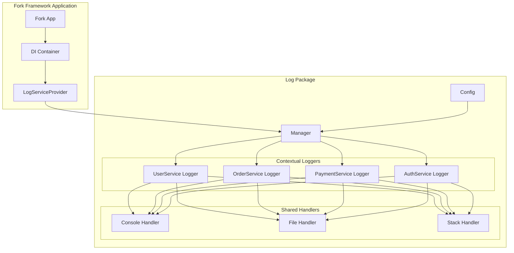
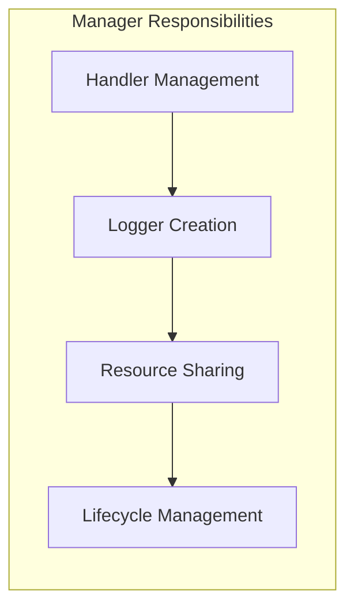
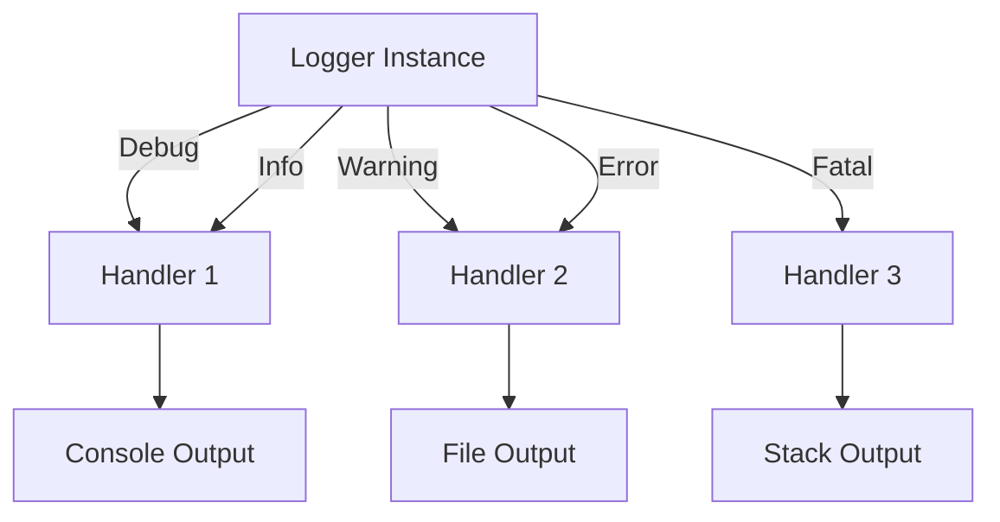
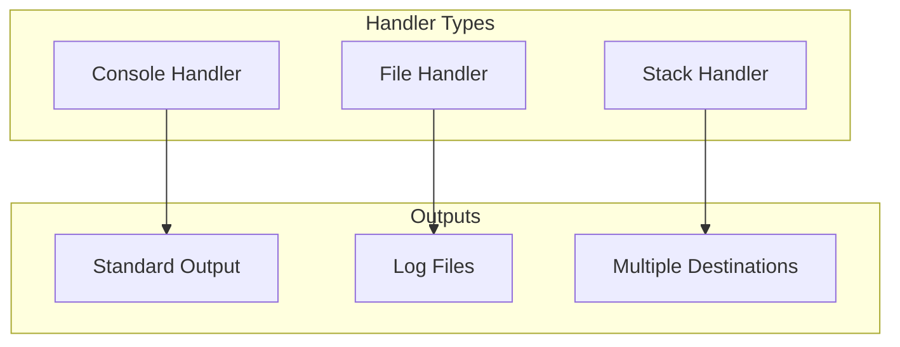
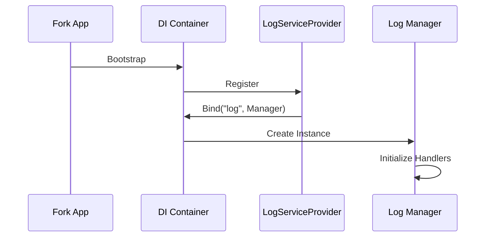
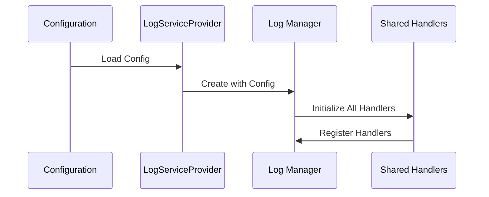
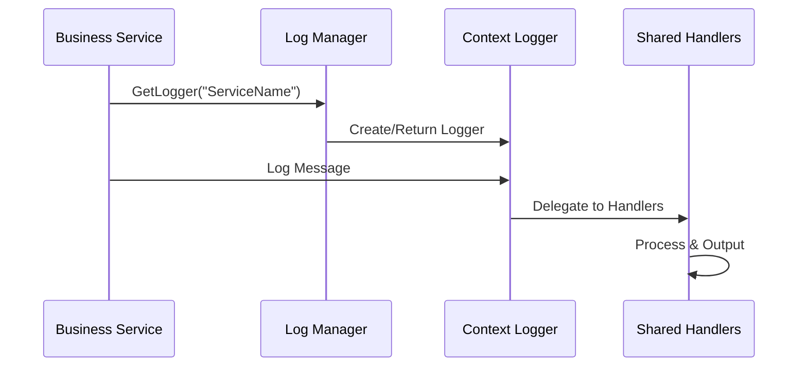

# Tổng Quan Kiến Trúc

Package log được thiết kế đặc biệt cho Fork Framework, cung cấp hệ thống logging hiệu suất cao với kiến trúc shared handlers và contextual loggers.

## Kiến Trúc Tổng Quan



## Các Thành Phần Chính

### 1. Manager (Quản Lý Tập Trung)

Manager là thành phần trung tâm thực hiện pattern **Shared Handlers Architecture**:

- **Shared Handlers**: Tất cả loggers cùng chia sẻ các handler instances
- **GetOrCreate Pattern**: Logger được tạo tự động theo context khi chưa tồn tại
- **Runtime Management**: Quản lý handlers và loggers trong runtime
- **Resource Efficiency**: Tránh duplicate handlers, tiết kiệm tài nguyên



### 2. Logger (Contextual Logging)

Mỗi logger được gắn với một context cụ thể:

- **Context-Based**: Logger được định danh bởi context (vd: "UserService", "OrderService")
- **Structured Logging**: Hỗ trợ structured logs với key-value pairs
- **Level Filtering**: Logs được filter theo level được cấu hình
- **Handler Delegation**: Ủy thác việc ghi log cho các handlers



### 3. Handlers (Output Processors)

Handlers xử lý việc xuất logs ra các đích khác nhau:

#### Console Handler
- Xuất logs ra stdout/stderr
- Hỗ trợ color coding theo level
- Tối ưu cho development environment

#### File Handler  
- Ghi logs vào file
- Hỗ trợ file rotation theo size
- Tối ưu cho production logging

#### Stack Handler
- Kết hợp nhiều handlers khác
- Cho phép log cùng lúc ra nhiều đích
- Linh hoạt trong cấu hình



## Tích Hợp Fork Framework

### Service Provider Pattern

Package log tích hợp với Fork Framework thông qua `LogServiceProvider`:



### Dependency Injection

Logger có thể được inject vào các service khác:

```go
type UserService struct {
    logger log.Logger
}

func NewUserService(container *container.Container) *UserService {
    manager := container.Get("log").(log.Manager)
    return &UserService{
        logger: manager.GetLogger("UserService"),
    }
}
```

## Workflow Chuẩn

### 1. Khởi Tạo Application



### 2. Runtime Logging



## Tính Năng Nâng Cao

### 1. Runtime Handler Management

```go
// Thêm handler mới trong runtime
manager.AddHandler(log.HandlerTypeCustom, customHandler)

// Cấu hình handler cho logger cụ thể
manager.SetHandler("PaymentService", log.HandlerTypeCustom)

// Gỡ bỏ handler
manager.RemoveHandler(log.HandlerTypeCustom)
```

### 2. Context Switching

```go
// Logger có thể thay đổi context
userLogger := manager.GetLogger("UserService")
userLogger.SetContext("UserService::Registration")

// Log sẽ hiển thị context mới
userLogger.Info("User registration started")
// Output: [INFO] [UserService::Registration] User registration started
```

### 3. Performance Optimization

- **Handler Reuse**: Handlers được chia sẻ giữa các loggers
- **Level Filtering**: Logs được filter sớm để tránh xử lý không cần thiết
- **Concurrent Safe**: Thread-safe cho các ứng dụng concurrent
- **Memory Efficient**: Tối ưu memory usage thông qua shared resources

## Patterns Được Hỗ Trợ

### 1. Singleton Pattern (Manager)
- Một Manager instance duy nhất trong application
- Quản lý tất cả handlers và loggers

### 2. Factory Pattern (Logger Creation)
- Manager tạo loggers theo context
- GetOrCreate pattern đảm bảo không duplicate

### 3. Strategy Pattern (Handlers)
- Các handler implementations khác nhau
- Có thể swap handlers trong runtime

### 4. Observer Pattern (Stack Handler)
- Stack handler notify cho multiple sub-handlers
- Loose coupling giữa loggers và output destinations

## So Sánh Với Các Giải Pháp Khác

| Tính Năng | Fork Log | Logrus | Zap | Go Log |
|-----------|----------|--------|-----|---------|
| Shared Handlers | ✅ | ❌ | ❌ | ❌ |
| Contextual Loggers | ✅ | Partial | Partial | ❌ |
| Fork Framework Integration | ✅ | ❌ | ❌ | ❌ |
| Runtime Handler Management | ✅ | Limited | Limited | ❌ |
| Zero Allocation | Partial | ❌ | ✅ | ❌ |
| Structured Logging | ✅ | ✅ | ✅ | ❌ |

Thiết kế này đảm bảo package log phù hợp hoàn hảo với kiến trúc và triết lý của Fork Framework.
