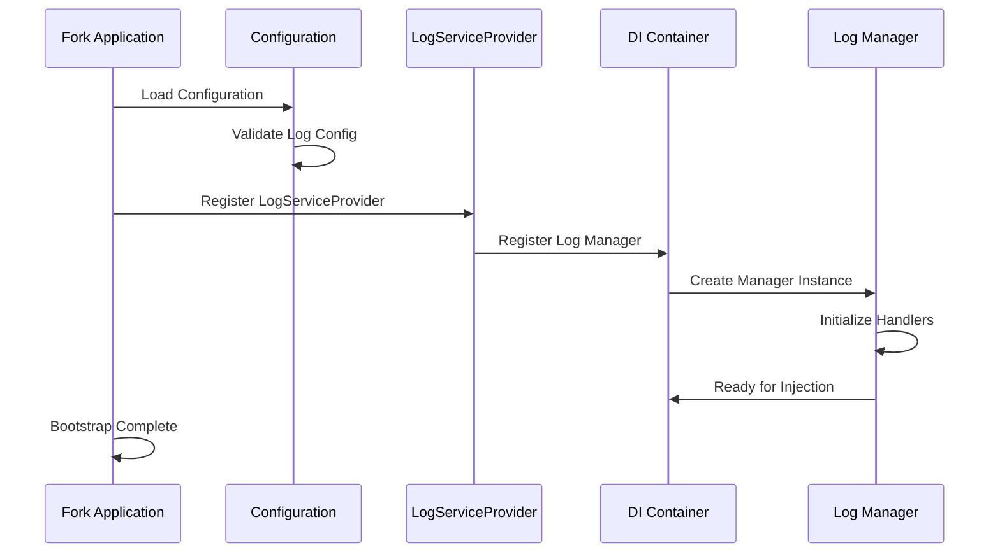
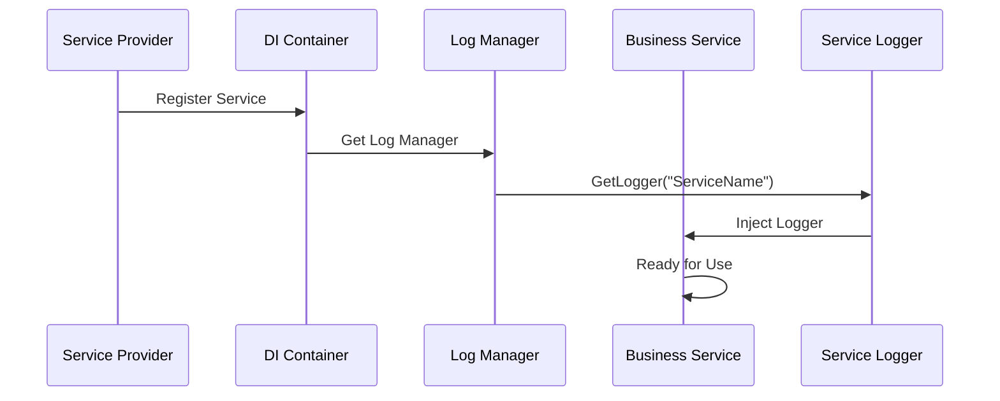
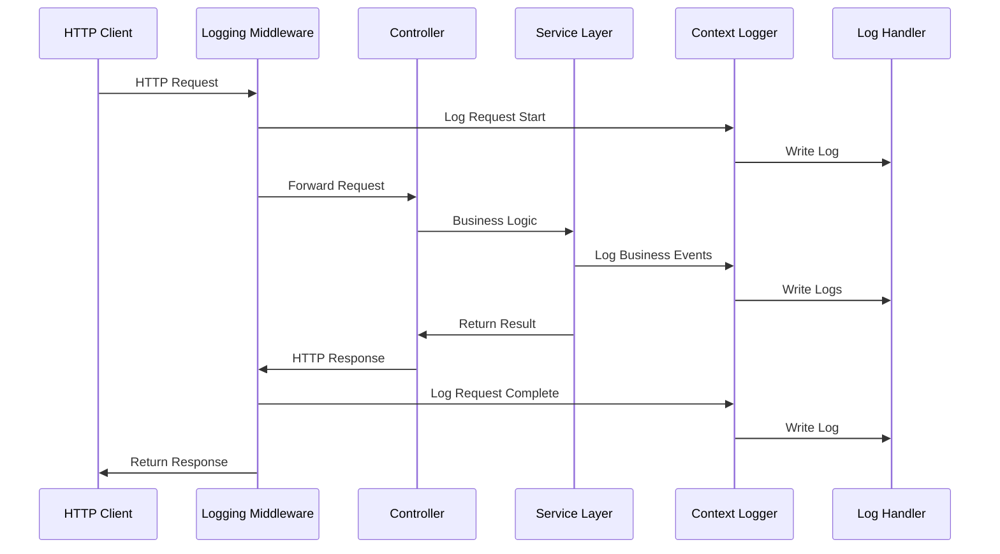

# Workflows và Patterns

Tài liệu này mô tả các workflows chuẩn và design patterns khi sử dụng package log trong Fork Framework applications.

## Application Lifecycle Workflows

### 1. Bootstrap Workflow



#### Ví dụ Implementation

```go
// main.go
func main() {
    // 1. Load configuration
    config, err := loadConfiguration()
    if err != nil {
        log.Fatal("Failed to load configuration:", err)
    }
    
    // 2. Validate log configuration
    if err := config.Log.Validate(); err != nil {
        log.Fatal("Invalid log configuration:", err)
    }
    
    // 3. Create Fork application
    app := fork.NewApplication()
    
    // 4. Register log service provider
    app.RegisterProvider(providers.NewLogProvider(config.Log))
    
    // 5. Register other providers
    app.RegisterProvider(providers.NewDatabaseProvider(config.Database))
    app.RegisterProvider(providers.NewHTTPProvider(config.HTTP))
    
    // 6. Bootstrap application
    if err := app.Bootstrap(); err != nil {
        log.Fatal("Failed to bootstrap application:", err)
    }
    
    // 7. Start application
    app.Run()
}
```

### 2. Service Registration Workflow



#### Ví dụ Service Registration

```go
// providers/user_provider.go
type UserServiceProvider struct{}

func (p *UserServiceProvider) Register(container *container.Container) {
    container.Singleton("user_service", func() interface{} {
        // Inject dependencies
        logManager := container.Get("log").(log.Manager)
        database := container.Get("database").(*sql.DB)
        
        return services.NewUserService(logManager, database)
    })
}

// services/user_service.go
type UserService struct {
    logger log.Logger
    db     *sql.DB
}

func NewUserService(logManager log.Manager, db *sql.DB) *UserService {
    return &UserService{
        logger: logManager.GetLogger("UserService"),
        db:     db,
    }
}
```

### 3. Request Processing Workflow



## Logging Patterns

### 1. Contextual Logging Pattern

Sử dụng context để group logs related đến một operation cụ thể:

```go
// Pattern: Service-specific loggers
type OrderService struct {
    logger log.Logger
}

func NewOrderService(logManager log.Manager) *OrderService {
    return &OrderService{
        logger: logManager.GetLogger("OrderService"),
    }
}

func (s *OrderService) ProcessOrder(orderID string) error {
    // Log with operation context
    s.logger.Info("Processing order started", 
        "order_id", orderID,
        "operation", "process_order",
    )
    
    // Business logic with contextual logging
    if err := s.validateOrder(orderID); err != nil {
        s.logger.Error("Order validation failed",
            "order_id", orderID,
            "operation", "validate_order",
            "error", err.Error(),
        )
        return err
    }
    
    if err := s.chargePayment(orderID); err != nil {
        s.logger.Error("Payment processing failed",
            "order_id", orderID,
            "operation", "charge_payment", 
            "error", err.Error(),
        )
        return err
    }
    
    s.logger.Info("Order processed successfully",
        "order_id", orderID,
        "operation", "process_order",
    )
    
    return nil
}
```

### 2. Hierarchical Context Pattern

Tạo context phân cấp để track request flow:

```go
// Pattern: Request-scoped contexts
func HandleOrderCreation(w http.ResponseWriter, r *http.Request) {
    requestID := generateRequestID()
    
    // Root context cho request
    requestLogger := logManager.GetLogger("OrderAPI")
    requestLogger.Info("Order creation request received",
        "request_id", requestID,
        "method", r.Method,
        "path", r.URL.Path,
    )
    
    // Service context kế thừa request context
    orderService := NewOrderServiceWithContext(requestLogger, requestID)
    paymentService := NewPaymentServiceWithContext(requestLogger, requestID)
    
    // Tất cả logs sẽ có request_id
    order, err := orderService.CreateOrder(requestData)
    if err != nil {
        requestLogger.Error("Order creation failed",
            "request_id", requestID,
            "error", err.Error(),
        )
        http.Error(w, "Internal Server Error", http.StatusInternalServerError)
        return
    }
    
    requestLogger.Info("Order creation completed",
        "request_id", requestID,
        "order_id", order.ID,
    )
}

func NewOrderServiceWithContext(parentLogger log.Logger, requestID string) *OrderService {
    // Tạo logger với context mở rộng
    contextLogger := logManager.GetLogger("OrderService")
    
    return &OrderService{
        logger: &ContextualLogger{
            logger:    contextLogger,
            requestID: requestID,
        },
    }
}
```

### 3. Error Propagation Pattern

Propagate errors với logging context:

```go
// Pattern: Error propagation với logging
type ServiceError struct {
    Operation string
    Context   map[string]interface{}
    Cause     error
}

func (e *ServiceError) Error() string {
    return fmt.Sprintf("%s failed: %v", e.Operation, e.Cause)
}

func (s *OrderService) ProcessOrder(orderID string) error {
    baseContext := map[string]interface{}{
        "order_id": orderID,
        "service":  "OrderService",
    }
    
    // Step 1: Validate
    if err := s.validateOrder(orderID); err != nil {
        s.logger.Error("Order validation failed", 
            "order_id", orderID,
            "step", "validation",
            "error", err.Error(),
        )
        
        return &ServiceError{
            Operation: "validate_order",
            Context:   baseContext,
            Cause:     err,
        }
    }
    
    // Step 2: Process payment
    if err := s.processPayment(orderID); err != nil {
        s.logger.Error("Payment processing failed",
            "order_id", orderID, 
            "step", "payment",
            "error", err.Error(),
        )
        
        return &ServiceError{
            Operation: "process_payment",
            Context:   baseContext,
            Cause:     err,
        }
    }
    
    s.logger.Info("Order processed successfully", "order_id", orderID)
    return nil
}
```

### 4. Performance Monitoring Pattern

Log performance metrics để monitoring:

```go
// Pattern: Performance monitoring
type PerformanceLogger struct {
    logger log.Logger
}

func NewPerformanceLogger(logger log.Logger) *PerformanceLogger {
    return &PerformanceLogger{logger: logger}
}

func (p *PerformanceLogger) TimeOperation(operation string, fn func() error, context ...interface{}) error {
    start := time.Now()
    
    // Log operation start
    p.logger.Info("Operation started",
        append(context, "operation", operation, "start_time", start)...,
    )
    
    // Execute operation
    err := fn()
    duration := time.Since(start)
    
    // Log operation result
    logArgs := append(context, 
        "operation", operation,
        "duration", duration.String(),
        "duration_ms", duration.Milliseconds(),
    )
    
    if err != nil {
        p.logger.Error("Operation failed",
            append(logArgs, "error", err.Error())...,
        )
    } else {
        p.logger.Info("Operation completed", logArgs...)
    }
    
    return err
}

// Usage
func (s *OrderService) CreateOrder(data OrderData) (*Order, error) {
    perfLogger := NewPerformanceLogger(s.logger)
    
    var order *Order
    var err error
    
    err = perfLogger.TimeOperation("create_order", func() error {
        order, err = s.doCreateOrder(data)
        return err
    }, "user_id", data.UserID, "product_count", len(data.Items))
    
    return order, err
}
```

## Environment-Specific Workflows

### 1. Development Environment

```go
// Development configuration và workflow
func setupDevelopmentLogging() *log.Config {
    return &log.Config{
        Level: handler.DebugLevel, // Log tất cả levels
        Console: log.ConsoleConfig{
            Enabled: true,
            Colored: true, // Dễ đọc trong terminal
        },
        File: log.FileConfig{
            Enabled: true,
            Path:    "logs/dev.log",
            MaxSize: 10 * 1024 * 1024, // 10MB
        },
        Stack: log.StackConfig{
            Enabled: true, // Log đồng thời console và file
            Handlers: log.StackHandlers{
                Console: true,
                File:    true,
            },
        },
    }
}

// Development-specific logging practices
func developmentLogging() {
    logger := logManager.GetLogger("DevService")
    
    // Verbose debug logging
    logger.Debug("Detailed debug information",
        "sql_query", "SELECT * FROM users WHERE id = ?",
        "parameters", []interface{}{12345},
        "execution_plan", "index_scan",
    )
    
    // Log request/response bodies
    logger.Debug("HTTP request body", "body", string(requestBody))
    logger.Debug("HTTP response body", "body", string(responseBody))
}
```

### 2. Production Environment

```go
// Production configuration và workflow
func setupProductionLogging() *log.Config {
    return &log.Config{
        Level: handler.InfoLevel, // Chỉ Info và cao hơn
        Console: log.ConsoleConfig{
            Enabled: false, // Tắt console trong production
            Colored: false,
        },
        File: log.FileConfig{
            Enabled: true,
            Path:    "/var/log/myapp/app.log",
            MaxSize: 100 * 1024 * 1024, // 100MB
        },
        Stack: log.StackConfig{
            Enabled: false, // Chỉ file logging
        },
    }
}

// Production-specific logging practices
func productionLogging() {
    logger := logManager.GetLogger("ProdService")
    
    // Structured business events
    logger.Info("Order created",
        "order_id", "ORD-12345",
        "user_id", 67890,
        "amount", 99.99,
        "currency", "USD",
    )
    
    // Error logging với context
    logger.Error("Database connection failed",
        "host", "db.prod.example.com",
        "database", "orders",
        "retry_count", 3,
        "error", err.Error(),
    )
    
    // Performance metrics
    logger.Info("API response time",
        "endpoint", "/api/orders",
        "method", "POST",
        "response_time_ms", 150,
        "status_code", 201,
    )
}
```

### 3. Testing Environment

```go
// Testing với mock loggers
func setupTestLogging() log.Manager {
    // Sử dụng in-memory logger cho tests
    config := &log.Config{
        Level: handler.DebugLevel,
        Console: log.ConsoleConfig{
            Enabled: false, // Tắt output trong tests
        },
        File: log.FileConfig{
            Enabled: false,
        },
    }
    
    return log.NewManager(config)
}

// Test-specific patterns
func TestOrderService_CreateOrder(t *testing.T) {
    // Setup test logger
    mockLogger := &MockLogger{}
    service := &OrderService{logger: mockLogger}
    
    // Execute test
    order, err := service.CreateOrder(testData)
    
    // Assert logs
    assert.NoError(t, err)
    assert.Contains(t, mockLogger.Logs, "Order created")
    assert.NotContains(t, mockLogger.Logs, "sensitive_data")
}
```

## Integration Patterns

### 1. External Service Integration

```go
// Pattern: External service calls với comprehensive logging
type ExternalAPIClient struct {
    logger log.Logger
    client *http.Client
}

func (c *ExternalAPIClient) CallExternalAPI(endpoint string, payload interface{}) (*APIResponse, error) {
    requestID := generateRequestID()
    
    // Log outgoing request
    c.logger.Info("External API call initiated",
        "request_id", requestID,
        "endpoint", endpoint,
        "method", "POST",
    )
    
    start := time.Now()
    
    // Make API call
    response, err := c.makeRequest(endpoint, payload)
    duration := time.Since(start)
    
    if err != nil {
        c.logger.Error("External API call failed",
            "request_id", requestID,
            "endpoint", endpoint,
            "duration_ms", duration.Milliseconds(),
            "error", err.Error(),
        )
        return nil, err
    }
    
    // Log successful response
    c.logger.Info("External API call completed",
        "request_id", requestID,
        "endpoint", endpoint,
        "status_code", response.StatusCode,
        "duration_ms", duration.Milliseconds(),
    )
    
    return response, nil
}
```

### 2. Database Transaction Logging

```go
// Pattern: Database operations với transaction logging
type OrderRepository struct {
    logger log.Logger
    db     *sql.DB
}

func (r *OrderRepository) CreateOrderWithItems(order *Order, items []OrderItem) error {
    txID := generateTransactionID()
    
    r.logger.Info("Database transaction started",
        "transaction_id", txID,
        "operation", "create_order_with_items",
        "order_id", order.ID,
        "item_count", len(items),
    )
    
    tx, err := r.db.Begin()
    if err != nil {
        r.logger.Error("Failed to begin transaction",
            "transaction_id", txID,
            "error", err.Error(),
        )
        return err
    }
    
    // Create order
    if err := r.createOrder(tx, order); err != nil {
        tx.Rollback()
        r.logger.Error("Failed to create order",
            "transaction_id", txID,
            "order_id", order.ID,
            "error", err.Error(),
        )
        return err
    }
    
    // Create order items
    for _, item := range items {
        if err := r.createOrderItem(tx, item); err != nil {
            tx.Rollback()
            r.logger.Error("Failed to create order item",
                "transaction_id", txID,
                "order_id", order.ID,
                "item_id", item.ID,
                "error", err.Error(),
            )
            return err
        }
    }
    
    // Commit transaction
    if err := tx.Commit(); err != nil {
        r.logger.Error("Failed to commit transaction",
            "transaction_id", txID,
            "error", err.Error(),
        )
        return err
    }
    
    r.logger.Info("Database transaction completed",
        "transaction_id", txID,
        "order_id", order.ID,
        "items_created", len(items),
    )
    
    return nil
}
```

### 3. Background Job Processing

```go
// Pattern: Background job với progress logging
type JobProcessor struct {
    logger log.Logger
}

func (p *JobProcessor) ProcessEmailBatch(jobID string, emails []Email) error {
    p.logger.Info("Batch job started",
        "job_id", jobID,
        "job_type", "email_batch",
        "total_emails", len(emails),
    )
    
    processed := 0
    failed := 0
    
    for i, email := range emails {
        if err := p.sendEmail(email); err != nil {
            failed++
            p.logger.Warning("Email sending failed",
                "job_id", jobID,
                "email_index", i,
                "recipient", email.To,
                "error", err.Error(),
            )
        } else {
            processed++
        }
        
        // Progress logging mỗi 100 emails
        if (i+1)%100 == 0 {
            p.logger.Info("Batch job progress",
                "job_id", jobID,
                "processed", processed,
                "failed", failed,
                "remaining", len(emails)-i-1,
                "progress_percent", float64(i+1)/float64(len(emails))*100,
            )
        }
    }
    
    p.logger.Info("Batch job completed",
        "job_id", jobID,
        "total_emails", len(emails),
        "processed", processed,
        "failed", failed,
        "success_rate", float64(processed)/float64(len(emails))*100,
    )
    
    return nil
}
```

## Monitoring và Alerting Workflows

### 1. Health Check Logging

```go
// Pattern: Health check với structured logging
type HealthChecker struct {
    logger log.Logger
    checks map[string]HealthCheck
}

func (h *HealthChecker) RunHealthChecks() HealthStatus {
    h.logger.Info("Health check cycle started")
    
    status := HealthStatus{
        Overall: "healthy",
        Checks:  make(map[string]CheckResult),
    }
    
    for name, check := range h.checks {
        start := time.Now()
        result := h.runSingleCheck(name, check)
        duration := time.Since(start)
        
        status.Checks[name] = result
        
        if result.Status != "healthy" {
            status.Overall = "unhealthy"
            h.logger.Error("Health check failed",
                "check_name", name,
                "status", result.Status,
                "error", result.Error,
                "duration_ms", duration.Milliseconds(),
            )
        } else {
            h.logger.Debug("Health check passed",
                "check_name", name,
                "duration_ms", duration.Milliseconds(),
            )
        }
    }
    
    h.logger.Info("Health check cycle completed",
        "overall_status", status.Overall,
        "total_checks", len(h.checks),
        "failed_checks", h.countFailedChecks(status.Checks),
    )
    
    return status
}
```

### 2. Metrics Collection Pattern

```go
// Pattern: Metrics collection với logging
type MetricsCollector struct {
    logger log.Logger
}

func (m *MetricsCollector) CollectSystemMetrics() {
    // CPU metrics
    cpuUsage := getCPUUsage()
    m.logger.Info("System metrics",
        "metric_type", "cpu",
        "usage_percent", cpuUsage,
        "timestamp", time.Now().Unix(),
    )
    
    // Memory metrics
    memUsage := getMemoryUsage()
    m.logger.Info("System metrics",
        "metric_type", "memory",
        "used_mb", memUsage.Used/1024/1024,
        "total_mb", memUsage.Total/1024/1024,
        "usage_percent", float64(memUsage.Used)/float64(memUsage.Total)*100,
        "timestamp", time.Now().Unix(),
    )
    
    // Disk metrics
    diskUsage := getDiskUsage()
    m.logger.Info("System metrics",
        "metric_type", "disk",
        "used_gb", diskUsage.Used/1024/1024/1024,
        "total_gb", diskUsage.Total/1024/1024/1024,
        "usage_percent", float64(diskUsage.Used)/float64(diskUsage.Total)*100,
        "timestamp", time.Now().Unix(),
    )
}
```

## Best Practices Summary

### 1. Workflow Design Principles

- **Consistent Context**: Luôn sử dụng context nhất quán trong một operation
- **Structured Data**: Sử dụng key-value pairs thay vì string interpolation
- **Error Propagation**: Propagate errors với đầy đủ context
- **Performance Monitoring**: Log timing và metrics cho critical operations

### 2. Environment Adaptation

- **Development**: Verbose logging với colors, debug level
- **Testing**: Mock loggers, assertion-friendly formats
- **Production**: Structured logs, appropriate levels, file output

### 3. Integration Guidelines

- **External Services**: Comprehensive request/response logging
- **Database Operations**: Transaction-level logging
- **Background Jobs**: Progress và completion logging
- **Health Checks**: Regular status logging với metrics

Package log workflows cung cấp foundation vững chắc cho observability và debugging trong Fork Framework applications.
